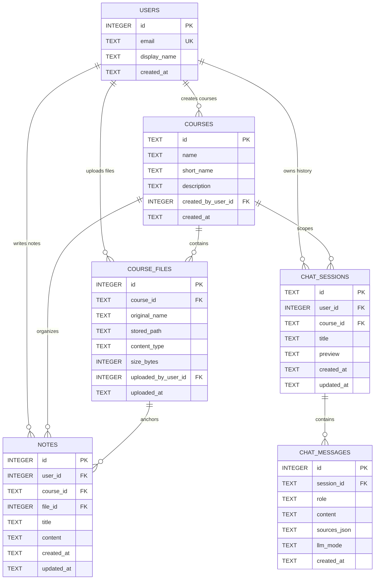
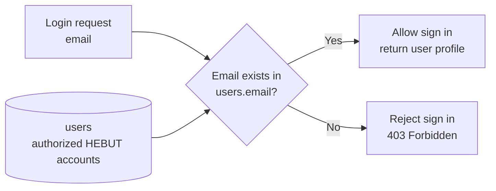

# Database Design

The system uses SQLite for local development. The database stores the complete
history for authorized login users, courses, course files, chat sessions, chat
messages, and notes. The browser keeps only the latest three chat sessions as a
short-term cache for fast recovery.

The `users` table is also the login whitelist. The application seeds three
HEBUT demo accounts into this table, and `/login` only succeeds when the
submitted email already exists in that authorized account set.

## Entity Relationship Diagram

## Login Account Constraint

## Table Constraints

| Table | Primary Key | Foreign Keys | Notes |
| --- | --- | --- | --- |
| `users` | `id` | None | Authorized login accounts only; `email` is unique |
| `courses` | `id` | `created_by_user_id -> users.id` | User-created courses are optional in addition to seeded courses |
| `course_files` | `id` | `course_id -> courses.id`, `uploaded_by_user_id -> users.id` | Uploaded courseware and preview source files |
| `chat_sessions` | `id` | `user_id -> users.id`, `course_id -> courses.id` | Complete database chat history |
| `chat_messages` | `id` | `session_id -> chat_sessions.id` | Ordered messages in one session |
| `notes` | `id` | `user_id -> users.id`, `course_id -> courses.id`, `file_id -> course_files.id` | Notes can optionally attach to one course file |

## Seed Login Accounts

Only these initialized HEBUT demo accounts can sign in:

| Email | Display Name |
| --- | --- |
| `li.minghao@hebut.edu.cn` | Li Minghao |
| `wang.yuxuan@hebut.edu.cn` | Wang Yuxuan |
| `zhao.ruilin@hebut.edu.cn` | Zhao Ruilin |

## Relationship Notes

- A user can create many courses, upload many files, own many chat sessions,
  and write many notes.
- A course can contain many files, chat sessions, and notes.
- A chat session contains many chat messages.
- A note belongs to one user and one course, and can optionally reference one
  course file.
- Deleting a course cascades to its files, chat sessions, chat messages, and
  notes. Deleting a user cascades to that user's chat sessions and notes.
